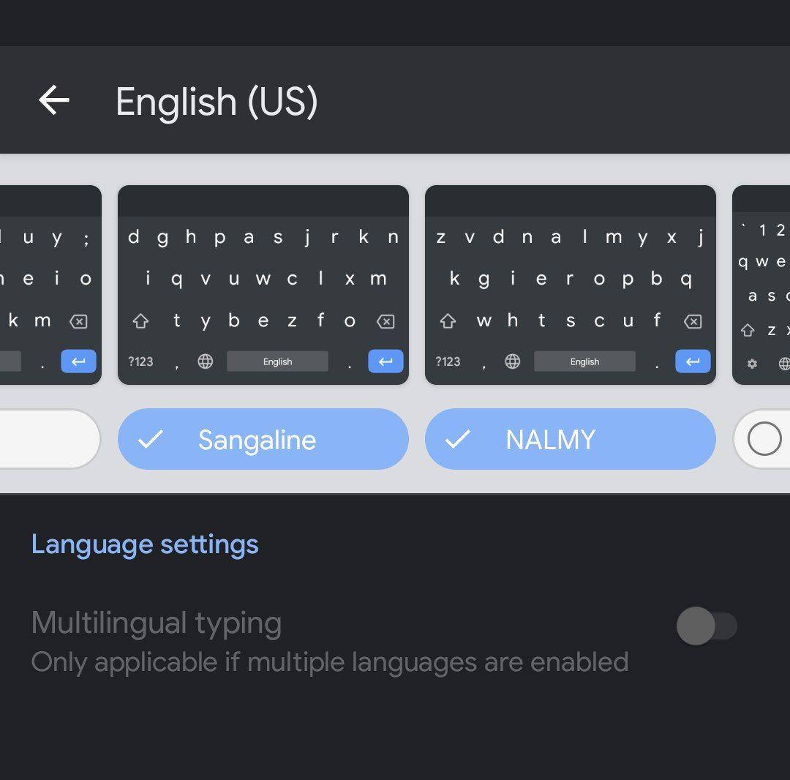

## Swype Patch

Custom swype keyboard layout patch for Gboard and SwiftKey Android App.

Added keyboard layouts which optimized for glide/swype typing:
- [Sangaline (DGHP)](http://sangaline.com/post/finding-an-optimal-keyboard-layout-for-swype/)
- [NALMY](https://jasmcole.com/2017/06/04/swype-right/)

## How to Use

This repository does not include the modified APKs, you need to either build it by yourself by using [scripts/](scripts/) or find and install one that someone else built.

Use [gboard-swype.sh](scripts/gboard-swype.sh) to generate the modified Gboard apk, [swiftkey.py](scripts/swiftkey.py) for SwiftKey.

**Notes**:
- the modified gboard apk has the same package name as the official Gboard App, you need to unistall official Gboard App if it's installed (requires root permission if it's a system App)
- those signed by a debug key, be careful with other poeple's build. Build by yourself and sign with your own key if you don't want to have this security risk

### Credit

Thanks for the inspiration/idea from the gist/project for the Gboard patch method

- [empathicqubit/patch-gboard.sh](https://gist.github.com/empathicqubit/c075158e915e4d85651bb83d4196cab4)
- [gkpln3/Gboard-Patched](https://github.com/gkpln3/Gboard-Patched)
